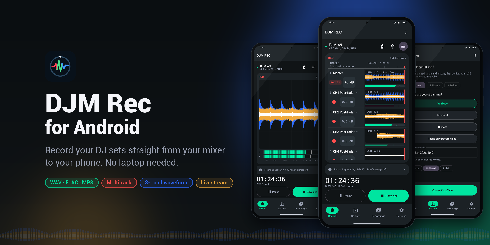
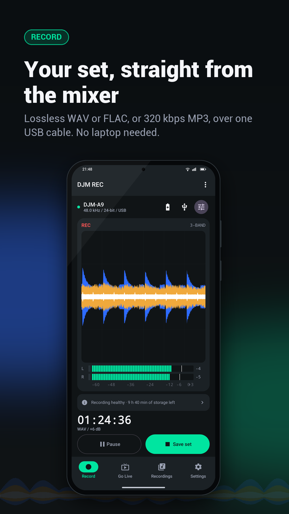
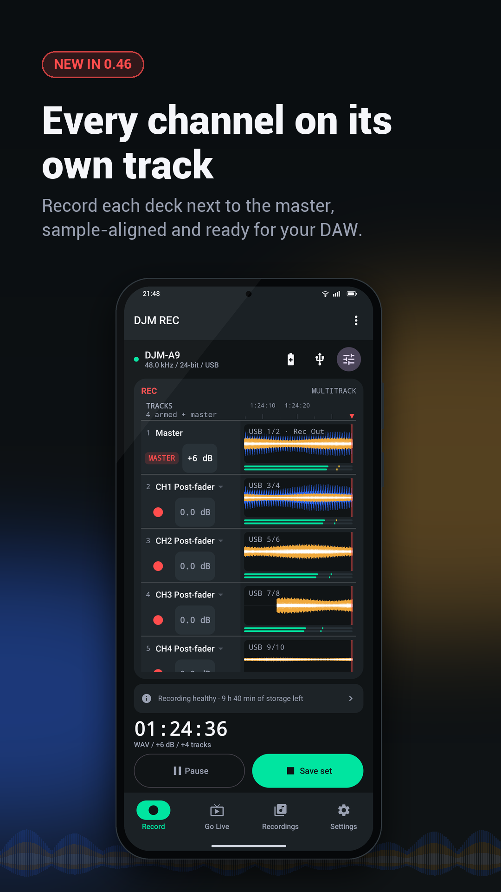
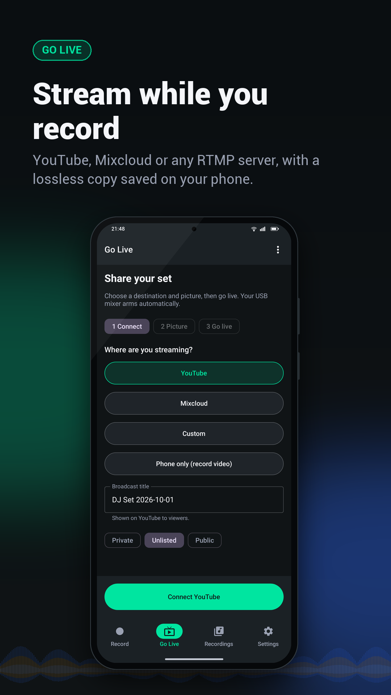
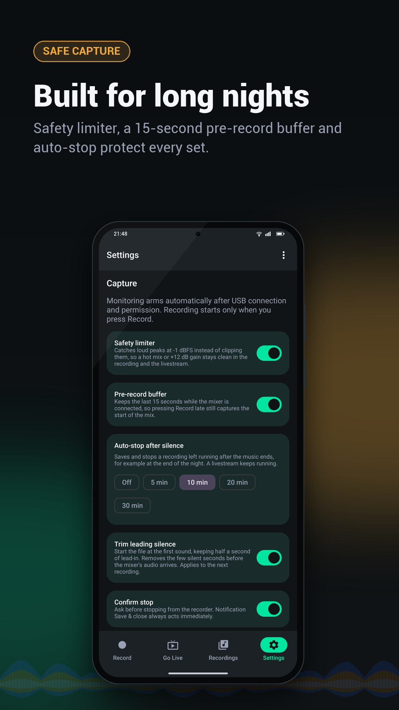

**Record your DJ sets from a compatible mixer directly to your Android phone.**

Requires Android 10+, a 64-bit ARM phone with USB host support, and a USB data cable.
Install the **release APK**; the debug APK is for testing.

## Supported devices

| Device | Support |
| --- | --- |
| **DJM-450, DJM-750MK2, DJM-900NXS2, DJM-A9, DJM-V5, DJM-V10, DJM-S11** | ✅ Supported |
| XDJ-XZ, XDJ-AZ, OPUS-QUAD, OMNIS-DUO | 🧪 Experimental |
| XDJ-RX3 | ⚠️ Not possible — USB audio is playback-only |
| Other USB audio interfaces | May work with a compatible USB audio input |

Use the mixer's **PC/Mac USB audio port** with a USB data cable. Experimental support is not a
guarantee. On the XDJ-RX3, use MASTER REC to USB storage instead. Pro DJ Link and USB protocol
research live on the separate
[`experimental` branch](https://github.com/P2GR/DJM-Rec-for-Android/tree/experimental).

## Start recording

1. Connect the mixer's **USB-B port** (the one you would normally plug into your laptop) to your
   phone with a **USB-B to USB-C data cable**. The DJM-A9 is the exception: it has a **USB-C port
   at the top**, so USB-C to USB-C works there. The **MULTI I/O USB port** used for
   *DJM Rec for iPhone* does **not** work with this app.
2. Open DJM Rec and allow USB access.
3. Play audio and check both meters; automatic arming starts monitoring, not recording.
4. Press **Record**, then **Save set** when finished. Files appear in **Sets** and `Music/DJMRec`.

Format, gain, USB channel pair and **Advanced mode** are in **Recording setup** (0 dB gain keeps
the input level). Keep USB connected during a set: force-stop, reboot or cable loss ends capture.

## Multitrack recording

Turn on **Advanced mode** in Recording setup to record every input pair of your mixer as its own
track next to the master, for example each deck post-fader, ready to mix again in a DAW.

- Each track gets its own lane with a live 3-band waveform, a level meter, an arm button and its
  own gain. The master keeps its gain, safety limiter, MP3 copy and livestream feed.
- Tracks are saved lossless (an MP3 set records its tracks as FLAC) in
  `Music/DJMRec/mix_<date> tracks/` and start and stop on the same sample as the master.
- On the **DJM-A9** and **DJM-750MK2** you can choose what each USB pair carries (a channel post- or
  pre-fader, Mic, Rec Out) from the track's source menu; the original routing is restored when
  capture stops. Other mixers and USB interfaces record their pairs as they are routed on the
  device.
- Needs an input with more than 2 channels. A stereo-only input has nothing extra to record.

## Features

<table>
  <tr>
    <td width="33%" valign="top"><h3>🎙️ Studio recording</h3>
WAV, FLAC and MP3 (320 kbps) with pause/resume and an optional MP3 copy.
</td>
    <td width="33%" valign="top"><h3>🎚️ Multitrack</h3>
Every mixer channel on its own track next to the master, sample-aligned, with per-track gain.
</td>
    <td width="33%" valign="top"><h3>🌊 CDJ waveform</h3>
3-band RGB waveform with stereo meters and clip warnings.
</td>
  </tr>
  <tr>
    <td width="33%" valign="top"><h3>🛡️ Safe capture</h3>
-1 dBFS safety limiter, 15-second pre-record buffer, leading-silence trim and auto-stop.
</td>
    <td width="33%" valign="top"><h3>✂️ Set editor</h3>
Trim, fades and loudness normalization (BS.1770 LUFS); export to MP3, WAV or FLAC.
</td>
    <td width="33%" valign="top"><h3>🔴 Livestream &amp; video</h3>
YouTube, Mixcloud and RTMP streaming with local recording and MP4 video.
</td>
  </tr>
  <tr>
    <td width="33%" valign="top"><h3>📱 Long-set ready</h3>
Background recording, persistent notification, set library, battery and heat warnings.
</td>
    <td width="33%" valign="top"><h3>🔌 Plug and record</h3>
Plug in an AlphaTheta/Pioneer mixer and DJM Rec offers to open with monitoring armed.
</td>
    <td width="33%" valign="top"><h3>🔓 Open source</h3>
MIT licensed, no ads, no account. Recordings never leave your phone unless you share them.
</td>
  </tr>
</table>

## Privacy

Optional Firebase diagnostics (crash reports and bounded mixer-connection events) help improve
mixer compatibility. No recorded audio, filenames or personal data is collected. Turn it off in
**Settings > Diagnostics & privacy**.

## ☕ Buy me a coffee

If DJM REC saved your set, you can support the project:

## License

MIT. Bundled libraries retain their own licenses.
