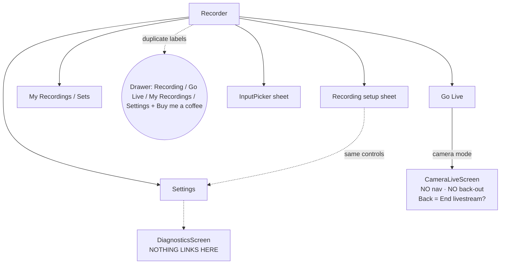

# DJM Rec — UX/UI Audit & Improvement Plan

> Produced with the **UI UX Pro Max** skill (style/color/typography/UX/stack catalogs + WCAG math).
> Scope: every screen and flow in `app/src/main/java/com/audiopro/djmrec/ui/` — recorder, inputs,
> setup, library, live wizard, camera console, onboarding, settings, diagnostics — plus the theme
> system (`ui/theme/`). Rule IDs like `[avoid-mixed-patterns]` refer to the skill's UX guideline
> catalog. Contrast ratios are computed (WCAG 2.x relative luminance), not eyeballed.

---

## 1. Executive summary

The app already has a strong visual identity: a deliberate pro-audio dark theme, good contrast,
real transport ergonomics (huge Record CTA, landscape two-pane), honest status copy, and defensive
dialogs. The weaknesses are **structural, not cosmetic**:

| # | Finding | Severity | Rule |
|---|---------|----------|------|
| 1 | **Camera live mode is a dead end** — no nav, no back-out; Back = "End livestream?" | 🔴 High | `[persistent-nav]` `[escape-routes]` |
| 2 | **Drawer duplicates the bottom nav with *different labels*** ("My Recordings" vs "Sets") | 🔴 High | `[avoid-mixed-patterns]` `[navigation-consistency]` |
| 3 | **`DiagnosticsScreen` is unreachable** — the support-report feature has no entry point | 🔴 High | `[empty-nav-state]` |
| 4 | Form errors render far from their fields; no inline validation; stream-key fields have no show/hide toggle | 🔴 High | `[error-placement]` `[inline-validation]` `[password-toggle]` |
| 5 | **LIVE is green in one screen and red in another** — meaning split across colors | 🟠 Medium | `[color-not-only]` `[consistency]` |
| 6 | Two parallel color systems (raw `Color.kt` vals vs `colorScheme`) + duplicated tokens | 🟠 Medium | `[color-semantic]` |
| 7 | Type scale only themed for 4 of ~9 text styles actually used | 🟠 Medium | `[text-styles-system]` |
| 8 | Silent successes (Export), Toast-vs-Dialog error mix, generic "File action failed" | 🟠 Medium | `[success-feedback]` `[error-clarity]` |
| 9 | Recorder health line is a ~24dp tap target that opens details | 🟠 Medium | `[touch-target-size]` |
| 10 | Dead components (`TransportControls`, `DeviceStatusCard`) + inconsistent "Sets/Recordings" copy | 🟡 Low | `[consistency]` |

**Scorecard** (skill's 10 rule categories):

| Category | Verdict | Notes |
|----------|---------|-------|
| 1. Accessibility | ⚠️ | Contrast **excellent (measured)**, icon labels good; fails: touch target (#9), dynamic type (fixed heights), color-only waveform legend |
| 2. Touch & Interaction | ⚠️ | Transport is great; #9 + fixed `.height(56.dp)` buttons clip large fonts |
| 3. Performance | ✅ | Compose is lean; only note: artwork source redraws 15 fps of a static bitmap |
| 4. Style Selection | ✅ | One coherent dark style, one icon family (Material filled), no emoji icons |
| 5. Layout & Responsive | ⚠️ | Landscape two-pane is exemplary; spacing scale is ad hoc (6/8/10/12/16/20/24dp mixed) |
| 6. Typography & Color | ⚠️ | Palette healthy (below); incomplete type scale, 11sp monospace labels under the 12sp floor |
| 7. Animation | ⚠️ | Nice `AnimatedContent` status chip; no motion tokens, no reduced-motion handling |
| 8. Forms & Feedback | 🔴 | Biggest gap — see §5 |
| 9. Navigation | 🔴 | Biggest gap — see §3 |
| 10. Charts & Data | ✅ | VU meter/waveform are purposeful; waveform meaning is color-only (see §6) |

---

## 2. Color scheme — verdict: **keep it** (it measures well), formalize it

### 2.1 Measured contrast (WCAG 2.x)

| Pair | Ratio | AA (4.5) | AAA (7.0) |
|------|------:|:---:|:---:|
| `TextPrimary #F5F6FA` on `BackgroundDark #101416` | **17.15:1** | ✅ | ✅ |
| `TextPrimary` on `SurfaceDark #1B2125` | **15.06:1** | ✅ | ✅ |
| `TextSecondary #9AA1B2` on `BackgroundDark` | **7.16:1** | ✅ | ✅ |
| `TextSecondary` on `SurfaceDark` | **6.29:1** | ✅ | — |
| `TextSecondary` on `SurfaceVariantDark #293238` | **5.05:1** | ✅ | — |
| `AccentGreen #00E5A0` on `SurfaceDark` | **9.85:1** | ✅ | ✅ |
| `AccentRed #FF4D4D` on `SurfaceDark` | **4.97:1** | ✅ | — |
| `AccentAmber #FFC93C` on `SurfaceDark` | **10.59:1** | ✅ | ✅ |
| Dark text on `AccentGreen` button | **11.22:1** | ✅ | ✅ |
| Dark text on `AccentRed` (Record) button | **5.66:1** | ✅ | — |

Every functional pair passes AA — better than the skill's generic music palettes ("Music
Streaming" `#22C55E`-on-dark family, `Music Creation` studio-purple). The mint-green/amber/red on
charcoal is also *more distinctive* as a brand than those catalog defaults, and the skill's own
`dark-mode-oled` style checklist ("dark greys, vibrant neon accents, text contrast 7:1+, no white
backgrounds, light mode not recommended") is exactly what this theme is. **Recommended changes are
small, not a re-theme:**

1. **Unify "LIVE" to red everywhere.** `LiveStatusCard` paints LIVE green while `CameraLiveScreen`
   `LiveDot` paints it red (the "on air" convention used by YouTube/Twitch). Split the semantics:
   **red = on air/recording**, **green = armed/ready/connected**, **amber = warning**, and never use
   one for the other's job. This is the only real *color logic* bug in the app.
2. **One color system.** Screens mix raw `Color.kt` vals (`TextSecondary`, `SurfaceDark`) with M3
   roles (`colorScheme.onSurfaceVariant`, `colorScheme.surface`) — sometimes in the same file
   (`InputPicker.kt` vs `RecorderScreen.kt`). Map every `Color.kt` val into the M3 scheme (custom
   slots) and consume roles only (see §7 tokens).
3. **De-duplicate tokens.** `MeterGreen/MeterAmber/MeterRed` are byte-identical to
   `AccentGreen/AccentAmber/AccentRed` — one set, aliased.
4. **Add two missing roles:** `outlineSubtle` (today everyone invents `.copy(alpha = 0.25f)`)
   and `statusLive` (= `AccentRed` once unified).
5. Optional polish: `AccentRed` at 4.97:1 on surfaces is the tightest pair — fine for large/bold
   status text (it is used bold), but keep it out of small body text. If you ever shrink it, lift to
   `#FF6B6B`.

### 2.2 Typography

- ✅ Monospace timer (`headlineLarge.copy(FontFamily.Monospace)`) — exactly right for a recorder
  (`[number-tabular]`).
- ⚠️ **Incomplete type scale** `[text-styles-system]`: `Type.kt` themes only
  `headlineSmall / titleMedium / bodyMedium / labelSmall`, but screens also use `headlineLarge`,
  `titleLarge`, `titleSmall`, `labelLarge`, `labelMedium`, `bodySmall` → those fall back to M3
  defaults, so hierarchy rhythm is half-custom, half-default. Theme the full set once.
- ⚠️ `labelSmall` is **11sp monospace** — under the 12sp floor `[readable-font-size]`; bump to 12sp
  and reserve monospace for values/timers, not sentences ("STEP 3 / 7" is fine, prose is not).
- Optional branding: the skill's music pairing (**Righteous / Poppins**) is for marketing surfaces;
  for the in-tool UI keep the neutral sans (DAW convention) and consider the display face only for
  the app title/marketing. Not required.

---

## 3. Information architecture & navigation (the #1 problem)

Current model:

Findings:

1. **Mixed nav patterns at one level** `[avoid-mixed-patterns]`: hamburger drawer *and* bottom bar
   expose the same four destinations — and disagree on names (`Recording/Go Live/My Recordings/
   Settings` vs `Record/Live/Sets/Settings`) `[navigation-consistency]`. Pick one primary (bottom
   bar is correct for 4 top-levels `[bottom-nav-limit]`), and demote the drawer to a true "More"
   menu (Support & diagnostics, About, Buy me a coffee) or delete it.
2. **"Sets" vs "Recordings"** — same noun named four ways ("Sets" tab, "My Recordings" drawer,
   "Your sets" heading, "Save set" / "Set saved" / `Music/DJMRec`). Choose **"Recordings"** (or
   "Sets") and apply it to tab, headings, dialogs, and share copy.
3. **Camera mode dead end** `[persistent-nav]` `[escape-routes]`: once camera-live, every route
   away is blocked (`BackHandler` → "End livestream?", bars hidden). The local Rec/Stop transport
   now exists, but the user still cannot, e.g., check Library or Settings without ending the show.
   Fix: a small "‹" that returns to the app **without** ending the stream (stream keeps running —
   service-owned), leaving "End stream" as the explicit destructive action.
4. **`DiagnosticsScreen` is orphaned** — defined, never instantiated (verified: zero call sites).
   The support-report feature is effectively invisible. Add "Support & diagnostics" to Settings
   (fits under a Support group) and/or restore a top-bar action.
5. **Dead components** `[consistency]`: `TransportControls` and `DeviceStatusCard` are never used.
   Note `TransportControls` has *better* ergonomics (72dp icon targets, "Stop & save" label) than
   the recorder's inline text-button transport — consider adopting it, otherwise delete both.
6. Settings IA: one long scroll mixes Capture / Diagnostics / Display / Background / Updates /
   Markers, and **"Save everything & close"** (app-wide destructive) sits *under Track markers*
   `[destructive-nav-separation]`. Restructure: **Capture · Recording · Display · Support · About**,
   with Save-&-close in a visually separated "Danger zone".
7. Duplicated settings surface: `RecordingSetupControls` (format/gain/pair) lives both in the setup
   sheet and the Settings "Capture" card. Fine as a shortcut, but keep one source of truth for
   copy/help text so they can't drift.

---

## 4. Screen-by-screen notes

**Recorder (home)** — the cockpit is right (input header, big meters, huge Record CTA, landscape
two-pane ✅). Fixes:
- Health/status line opens "Input status" but is a `TextButton` with `contentPadding(vertical = 0)`
  + `bodySmall` → ~24dp tall `[touch-target-size]`. Make the whole row ≥48dp.
- Status labels `RGB` / `METERS` are engineer jargon → "Waveform" / "Levels".
- `ARMED / NO SIGNAL`, `INPUT LIVE`, `STANDBY` etc. are good state language — keep.
- "Set saved" dialog with "Open sets" is genuinely good success UX `[success-feedback]` ✅.

**InputPicker sheet** — good empty state with actionable guidance ✅. Fixes: tapping a
"no permission" row silently requests USB permission with only a notice line — add explicit
"Allow USB access" affordance state; consider showing vid:pid for troubleshooting.

**Library** — good empty states ✅, decent overflow menu, inline player. Fixes: player placement
(bottom card) competes with the list — make it a mini-player sheet; export success is silent (§5);
delete is permanent with confirm but no undo (§5); rename dialog is fine but its field allows
autocaps/autocorrect noise for file names.

**Live wizard (Go Live)** — three-chip stepper is clear, orientation auto-detect is now shown ✅.
Fixes (forms — §5): field-level errors, password toggle, keyboard flags, "Go live" disabled-state
explanation.

**Camera console** — after the recent rework this is the strongest screen (LIVE dot, timer, viewers,
share, Rec transport, immersive). Remaining: nothing to reach other app areas (finding 3.3), and
LIVE-dot color unification (§2.1).

**Onboarding** — stepper, required-vs-skip, live grant re-check: solid ✅. Add a "review permissions"
link target in Settings (`[consistent-help]`) so skipped steps are recoverable in-place.

**Diagnostics** — copy is clear; replace Toast errors with the app's dialog/Snackbar pattern; wire
it into navigation (3.4).

---

## 5. Forms & feedback — the second-biggest gap

| Rule (skill) | Status | Where | Fix |
|---|---|---|---|
| `[error-placement]` (High) | 🔴 | Live wizard: `localError` prints at screen bottom | `isError` + `supportingText` under the offending field |
| `[inline-validation]` (Med) | 🔴 | Server/key validated only on Continue | Validate URL/key on blur; keep Continue for cross-field |
| `[password-toggle]` (Med) | 🔴 | Stream keys (Mixcloud/Custom) are masked, un-toggleable | Add show/hide `IconButton` in trailingIcon |
| `[input-type-keyboard]` (Low) | 🟠 | RTMP URL, stream key, rename | `keyboardOptions(keyboardType = Uri)`, disable caps/suggestions on keys/names |
| `[required-indicators]` (Low) | 🟠 | YouTube title gates Continue silently | Helper text "Required" on the field, not just a dead button |
| `[error-clarity]` (Med) | 🟠 | "File action failed", generic dialog titles | Surface `it.message` cause + a recovery action (Retry / Open settings) |
| `[success-feedback]` (Med) | 🟠 | **Export a copy succeeds silently** | Snackbar "Exported ⟨name⟩" |
| `[confirmation-dialogs]` (High) | ✅ | Delete, end-stream, stop-while-recording | Keep |
| `[undo-support]` (Low) | 🟠 | Delete is immediate-permanent | 5s "Undo" Snackbar before hard delete |
| `[toast-dismiss]` / `[toast-accessibility]` | 🟠 | `Toast` in DiagnosticsScreen | App-wide `SnackbarHost` pattern instead |
| `[empty-states]` | ✅ | Library, InputPicker | Keep the tone; add one CTA button to Library empty ("Record your first set") |
| `[multi-step-progress]` | ✅ | Onboarding, live wizard | Keep |

---

## 6. Accessibility pass

- ✅ Contrast: measured, all AA (§2.1). ✅ Icon buttons carry `contentDescription`, decorative
  icons correctly `null` `[icon-context]`. ✅ Selectable tiles use `Role.RadioButton` +
  `selectableGroup`.
- 🔴 Touch target: recorder health line (§4).
- 🟠 Dynamic type `[dynamic-type]`: fixed `.height(56.dp)` buttons (LiveStreamScreen) clip at large
  font scales — switch to `heightIn(min = 56.dp)`; audit other fixed heights.
- 🟠 Color-only meaning `[color-not-only]`: the **RGB waveform** encodes bass/mids/highs purely in
  color (help text exists only in Settings). Add a tiny persistent legend ("B/M/T" or "bass · mids ·
  highs") near the waveform, or an accessibility description.
- 🟠 Live regions `[aria-live-errors]`: error dialogs are announced (modal ✅), but the rotating
  health line and "SAVING/REC" chip would benefit from `liveRegion = Polite` (the codebase already
  does this in Settings — extend to recorder).
- 🟡 Reduced motion `[reduced-motion]`: waveform/pulse animations don't consult the system setting;
  keep data animations (they're functional) but gate decorative pulses (LIVE dot).

---

## 7. Proposed token architecture (three-layer)

Keeps the current look byte-for-byte while fixing findings 5/6/7 — implement in
`ui/theme/` only:

**Primitive (raw, private):**
`ink-950 #101416` · `ink-900 #1B2125` · `ink-800 #293238` · `grey-400 #9AA1B2` · `white #F5F6FA` ·
`mint-500 #00E5A0` · `amber-500 #FFC93C` · `red-500 #FF4D4D` · `red-400 #FF6B6B`(reserve) ·
waveform `#FF315E / #29F19C / #25A7FF` (data-viz only)

**Semantic (what screens consume):**

| Role | Maps to | Meaning |
|---|---|---|
| `background` / `surface` / `surfaceVariant` | ink-950/900/800 | elevation ladder |
| `onBackground` / `onSurface` | white | primary text |
| `onSurfaceVariant` | grey-400 | secondary text (min 12sp) |
| `accentReady` | mint-500 | armed / connected / success |
| `statusLive` | red-500 | **on air & recording** (unified) |
| `warning` | amber-500 | attention |
| `destructive` | red-500 | deletes & end-stream |
| `outlineSubtle` | white @ 25% | hairlines, tile borders |
| `meterLow/Mid/High` | alias accentReady/warning/statusLive | VU stops |

**Component:** `CaptureCard` (one card style — today `tonalElevation=1` vs `color=SurfaceDark`
varies), `StatusBanner` (replaces the ad-hoc health line: icon + state color + message + action),
`TransportButton` (adopt the 72dp pattern), `SelectTile` (FormatSelector/ChannelPairSelector are
90% duplicated — one tile component), `PrimaryButton` (`heightIn(min=56)`).

**Motion tokens:** `instant 100ms` (press feedback) · `fast 200ms` · `base 300ms` (sheets/crossfade)
· easing: decelerate-in / accelerate-out; LIVE pulse is decorative → gate on reduced motion.

---

## 8. Prioritized roadmap

> **STATUS — redesign pass implemented 2026-09-24.** Done: P0 #1 (StatusBanner 48dp), #2 (key
> toggle + keyboard flags + field errors), #4 (LIVE red unified), #5 (Diagnostics reachable via
> top-bar ⋮ menu), #6 ("Recordings" naming in nav/library; dialog copy partially), #7 (camera
> back-out without ending stream); P1 #8 (drawer removed — single bottom-bar nav + overflow menu),
> #9 (semantic tokens + full type scale + shapes), #10 StatusBanner adopted, #11 danger zone.
> Remaining: export-success Snackbar & delete-undo (#3/#12), dead-component removal (#10), full
> error-clarity string pass, dynamic-type audit, waveform legend, motion tokens (P2).

**P0 — quick wins (~a day, no architecture):**
1. Health line → 48dp tap target (§4)
2. Stream-key show/hide toggle + keyboard flags + field-level errors in live wizard (§5)
3. Export-success Snackbar; replace Toast with Snackbar (§5)
4. Unify LIVE color to red across screens (§2.1)
5. Wire "Support & diagnostics" into Settings (fixes orphaned feature) (§3)
6. One noun: "Recordings" or "Sets" everywhere (§3)
7. Camera mode: "‹" back-to-app without ending the stream (§3)

**P1 — structural (~3–5 days):**
8. Navigation model: bottom-bar primary, drawer → "More" menu (3.1/3.2)
9. Token layer + complete `Typography()` + de-dup meter colors (§7)
10. `StatusBanner` + adopt-or-delete dead components (§3.5, §7)
11. Settings IA with separated Danger zone (§6/§3.6)
12. Delete-undo Snackbar; error-clarity pass on all failure strings (§5)

**P2 — polish:**
13. Dynamic-type audit (fixed heights), waveform legend, live regions (§6)
14. Motion tokens + reduced-motion (§7)
15. Mini-player sheet in Library; Library empty-state CTA (§4)
16. Optional: deep links to recordings (`[deep-linking]`), brand display font for title/marketing

---

## Appendix — skill sources consulted

- `--design-system -p "DJM Rec"` (music-product pattern/style/color/typography + anti-patterns)
- `--domain style` "pro audio studio dark interface" → **dark-mode-oled** (checklist used in §2)
- `--domain color` "music dj dark mode" (Music Streaming / Music Creation palettes — compared in §2)
- `--domain typography` "music entertainment display" (Righteous/Poppins — §2.2)
- `--domain ux` "form error inline validation" · "delete undo destructive confirmation" ·
  "bottom navigation drawer tabs"
- `--stack jetpack-compose` "navigation bottom bar state" (event-based nav, typed routes,
  rememberSaveable — the app's `rememberSaveable` usage ✅; navigation via `Channel` pattern is the
  recommended upgrade if/when a real nav graph is introduced)
- WCAG contrast: computed from `ui/theme/Color.kt` hex values (§2.1)

---

## Second-pass review — 2026-09-24 (after MP3, bug reports, CDJ waveform, power-save work)

Skill-driven review (Quick Ref §1–§3 + Pre-Delivery checklist + focused `--domain ux` searches:
"reduced motion blinking animation", "live status updates screen reader", "form autosave draft
dismiss") against the surfaces added since the first audit.

**Fixed in this pass:**

| Rule | Severity | Finding | Fix |
|---|---|---|---|
| `[reduced-motion]` | High | Blinking REC dot (PowerSaveOverlay) + LIVE dot pulse (CameraLiveScreen) ignored motion preferences | New `rememberReducedMotion()` (reads `ANIMATOR_DURATION_SCALE`) gates decorative motion; functional data animation (waveform scroll, VU smoothing) intentionally keeps running |
| `[contextual-live-badge-updates]` | High | Status chips not announced; timers risk per-tick spam | Status phrases ("REC", "Recording live") are now single polite live regions; timers & viewer counts deliberately NOT live regions |
| `[form-autosave]` | Med | Bug-report description draft lost on rotation (`remember`) | `rememberSaveable` |
| `[back-behavior]` `[escape-routes]` | High | System Back exited the app from the power-save overlay | `BackHandler` closes the overlay (recording continues) |

**Verified good in the new surfaces:** VU meter (merged semantics with contextual "L input, peak
−6 dBFS, clipping" descriptions, clip latch, 80 ms smoothing), DiagnosticsScreen form (labels,
helper text, loading→success/error feedback, live regions), FormatSelector/ChannelPair tiles
(`Role.RadioButton` + `selectableGroup`), PowerSaveOverlay buttons (56dp, clear disabled state,
color + text for state).

**Remaining recommendations — ALL COMPLETED (later on 2026-09-24):**

- ~~`[color-not-only]` waveform legend~~ — user decision: no legend; the mode chip `3-BAND`
  and screen-reader description cover it.
- ~~`[dynamic-type]`~~ — fixed button heights switched to `heightIn(min=...)` in `LiveStreamScreen`
  (wizard CTA + choice buttons).
- ~~`[touch-target-size]`~~ — `FormatSelector` tiles now enforce `heightIn(min = 48.dp)`.
- ~~`[success-feedback]` / `[undo-support]`~~ — `SnackbarHost` in `LibraryScreen`: export/rename
  success snackbars; delete now goes to the system **Trash** (`RecordingLibrary.trash/untrash`,
  own MediaStore rows) with an **Undo** action; legacy file-based recordings fall back to a
  permanent delete with an honest dialog copy.
- ~~`[error-clarity]`~~ — library failure strings now state cause + recovery ("file is busy…
  close other apps and try again", "check free storage…").
- ~~`[consistency]`~~ — dead `TransportControls.kt` + `DeviceStatusCard.kt` deleted.
- ~~`[deep-linking]`~~ — designed + implemented: `djmrec://record|live|recordings|settings|support`
  intent-filter → `MainActivity` parses `intent.data.host` → `MainViewModel.pendingRoute` →
  `MainScreen` navigates. Future (not needed now): https App Links verification, per-recording
  links (would need content-URI permission plumbing).

**Bonus fixes in the same pass:** VU meter redesigned to theme tokens with a **peak-hold marker
+ latched dB readout** (holds the true take peak for 2 s, hardware-meter style); `RecordingLibrary`
now lists **MP3 recordings** (extension filter predated the MP3 format) and shares them with the
correct `audio/mpeg` MIME type; camera console got a labeled **‹ Exit** pill (top-left) as an
explicit way out that keeps the stream running.

## Motion & transitions pass (2026-09-24) — closes §7 / item 14

New `ui/theme/Motion.kt` (`DjmRecMotion`): **FAST 150 ms** (micro flips) · **BASE 300 ms** (enter)
· **EXIT 180 ms** (exit — deliberately faster than enter so leaving always feels responsive).
`pageTransform(forward, vertical, reduced)` = directional **quarter-slide + fade on a spring**
(navigation-direction continuity; vertical for steppers). `fadeTransform(reduced)` = spatial-less
crossfade for container swaps. Every builder takes `reduced` and collapses to a brief crossfade
under `rememberReducedMotion()`.

Every hard snap is now animated:
- **Bottom-nav destination switches** (`MainScreen`) — forward/backward-aware page motion
  (slides in from the trailing edge going forward, mirrored going back).
- **Onboarding steps** (`OnboardingScreen`) — vertical slide, next/previous aware.
- **Live-stream wizard steps** (`LiveStreamScreen`) — same vertical step motion.
- **Recorder transport Record ⇄ Pause/Save** — crossfade (no spatial implication).
- **Power-save overlay** enter/leave — crossfade with the recorder workspace.

Sheets/dialogs/menus already animate via Material 3. Guidance honored (skill-verified):
Compose animation APIs only, animation kept in the UI layer (never the VM), and all transitions
are interruptible/cancellable (springs + tweens; nothing waits on animation end).
